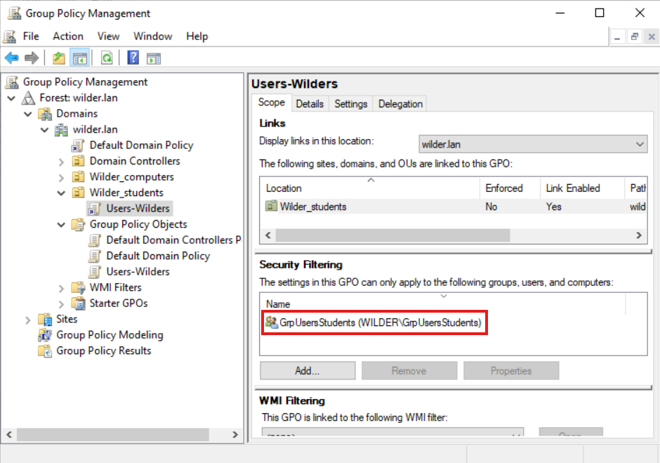
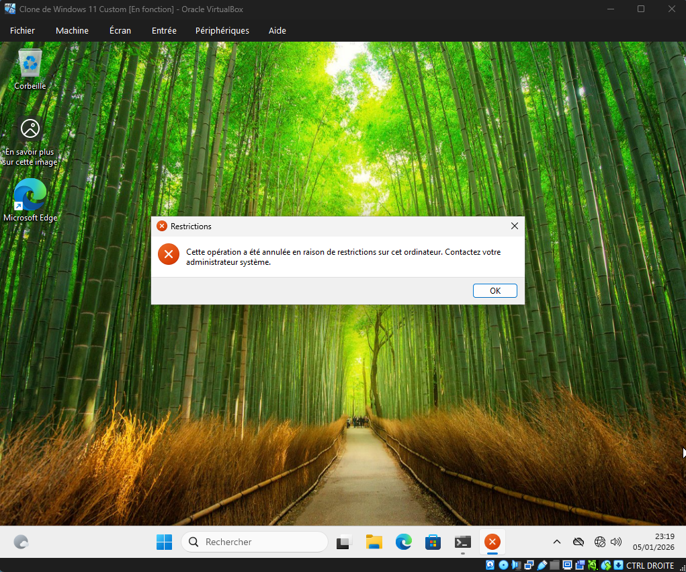

# AD_GPO

## La fenêtre de la GPO où on voit l'OU appliquée et le groupe de filtrage

* Sur l'image la GPO n'est pas active, je l'ai fais par la suite.

## Sur le client la fenêtre indiquant que l'accès est refusé

* Le message d'erreur apparaît que je veux ouvrir le panneau de contrôle
