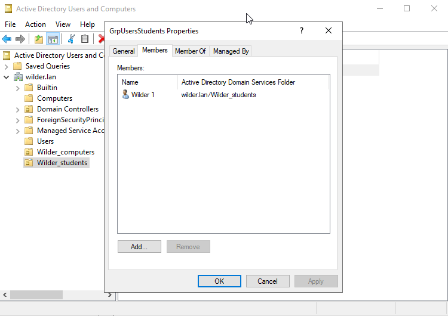
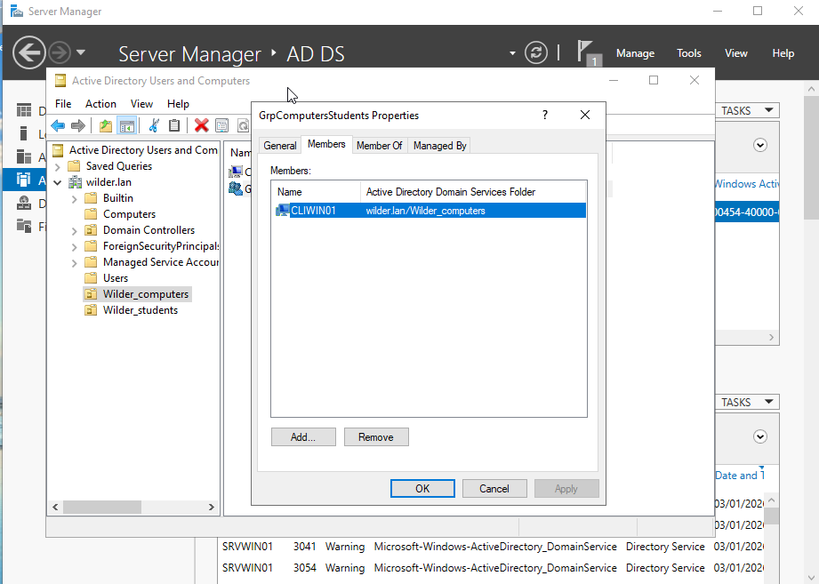

# AD_OU_Groupes

## Le OU et le groupe "Students"

* Création du OU
* Création du groupe
* Création du compte "Wilder1"
* Ajout du compte "Wilder1" dans le groupe "Students" dans le OU "Students"

## Le OU et le groupe "computeur"

* Création du OU
* Création du groupe
* Ajout du client "CLIWIN01" créer précédemment dans le groupe "Computeurs" dans le OU "Computeurs"

## Le client se trouve bien dans le domaine de l'AD

