# AD_Partage

Dans cet exercice l'objectif est de créer un dossier partagé sur un serveur Windows 2022, pour que chaque utilisateurs du domaine puisse acceder au dossier qui le concerne.
La documentation qui suit permet de suivre pas à pas les étapes pour créer, configurer et tester le dossier partagé.
  
## 1. Serveur AD

### Création et configuration de l'Active Directory :
  - Domaine : lab.lan
  - OU : LabSecurity - LabComputers - LabUsers

### Création des utilisateurs et des groupes qui composeront le domaine : 
  - Users :
    - Direction
    - Comptabilité
    - RH
    - Wilder
  
  - Groupes :
    - GrpUsersDirection
    - GrpUsersComptabilité
    - GrpUsersRH

Pensez à bien mettre les utilisateurs et les groupes dans les OU correspondantes.

| Utilisateurs | Groupes |
| ------------ | ------- |
| 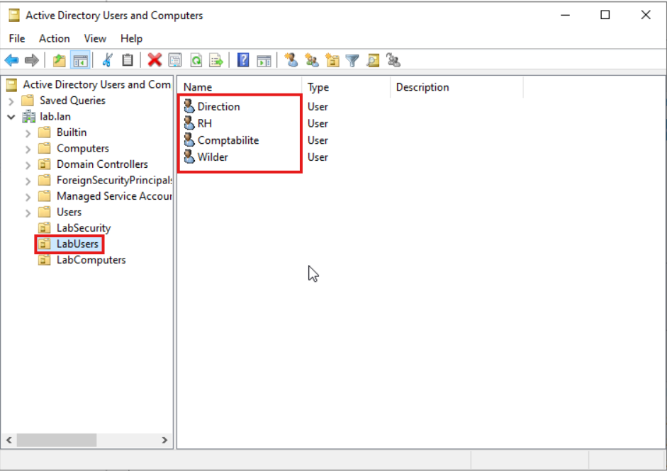 | 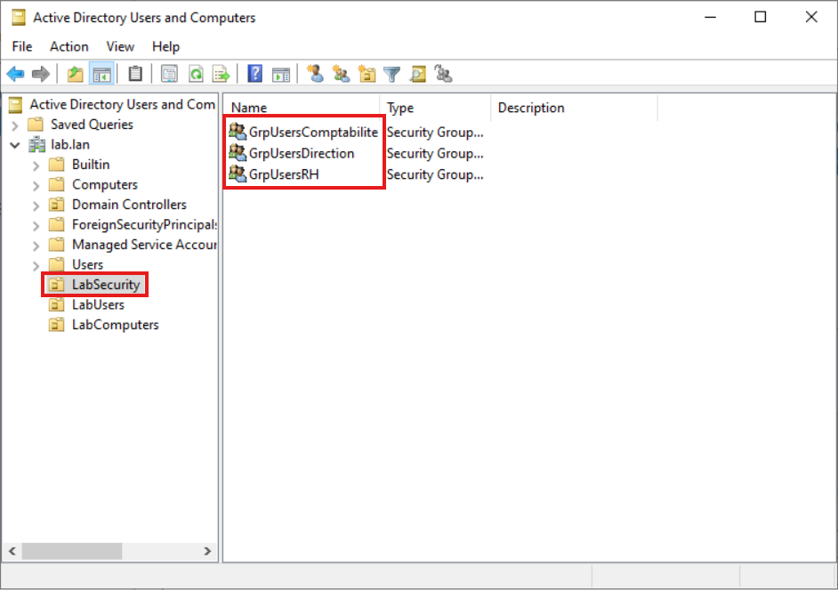 |

---

## 2. Dossier Partagé

### Création du dossier partagé sur la racine du serveur :
  - Nom : Documents_Entreprise
  - Emplacement : C:\

L'action peut s'effectuer des deux manières suivantes.

| CLI | GUI |
| --- | --- |
| 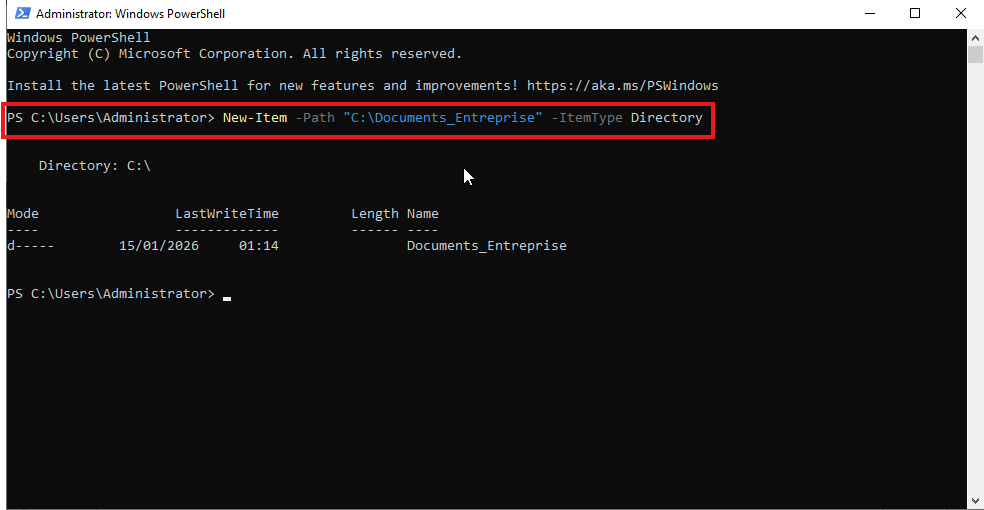 | 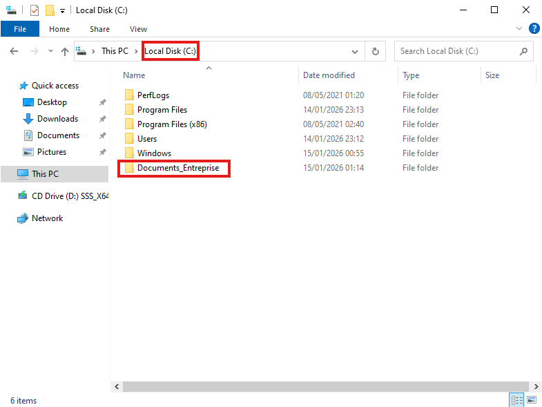 |

### Création des sous-dossiers :
  - Nom :
    - Direction
    - Comptabilité
    - RH
  - Emplacement : C:\Dossiers_Entreprise

L'action peut s'effectuer des deux manières suivantes.

| CLI | GUI |
| --- | --- |
|  |  |

### Initialisatiion du partage du "Dossiers_Entreprise" :
  - Nom : Docs
  - Emplacement : C:\Dossiers_Entreprise
  - Tout les droits : Administators
  - Droit de lecture : Domain Users

Avec les détails ci-dessus cette commande montre comment partagé le dossier avec des règles bien précisent.

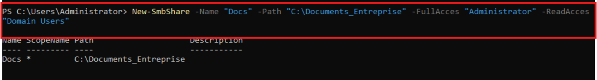

---

## 3. Droits et partage des sous-dossiers

### Sous-dossier Direction :
  - Droits de lecture :
    - Direction
  - Droits d'écriture :
    - Direction

Pensez bien à désactiver l'héritage dans les paramètres avancés de sécurité.

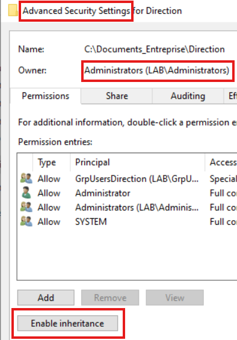

Le sous-dossier direction n'est accessible que par le Groupe Direction (GrpUsersDirection).  
L'action s'effectue dans les propriétés du dossier dans l'onglet sécurité, vous devez ajouter le groupe correspondant aux dossier et mettre droit de lecture et d'écriture.

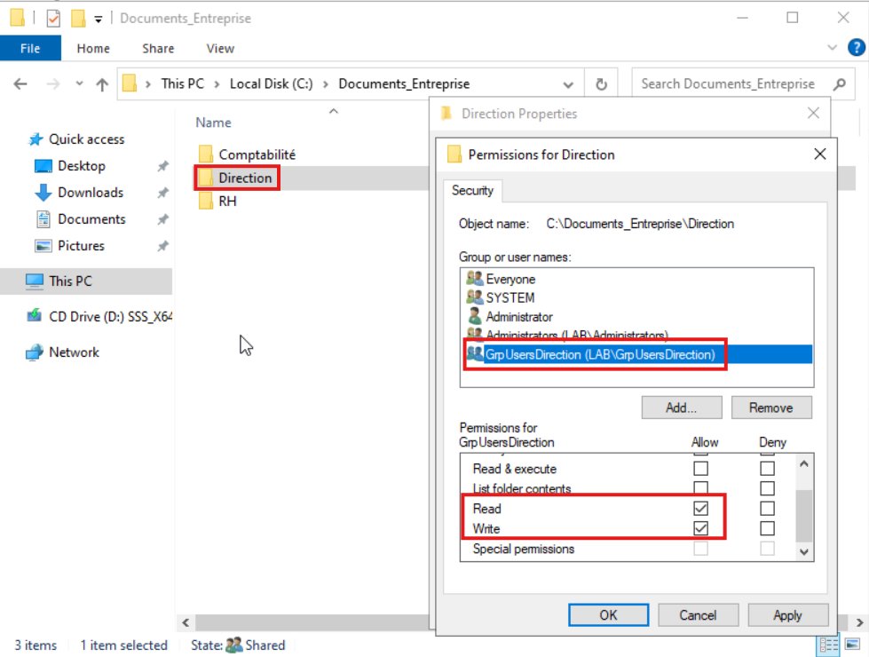

### Sous-dossier Comptabilité :
  - Droits de lecture :
    - Direction
    - Comptabilité
  - Droits d'écriture :
    - Direction
    - Comptabilité

Pensez bien à désactiver l'héritage dans les paramètres avancés de sécurité.

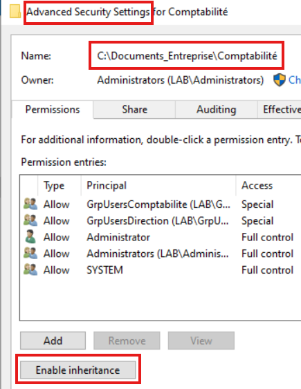

Le sous-dossier comptabilité est accessible que par le Groupe Compabilité et le Groupe Direction (GrpUsersComptabilite - GrpUsersDirection).  
L'action s'effectue dans les propriétés du dossier dans l'onglet sécurité, vous devez ajouter le groupe correspondant aux dossier et mettre droit de lecture et d'écriture.

| 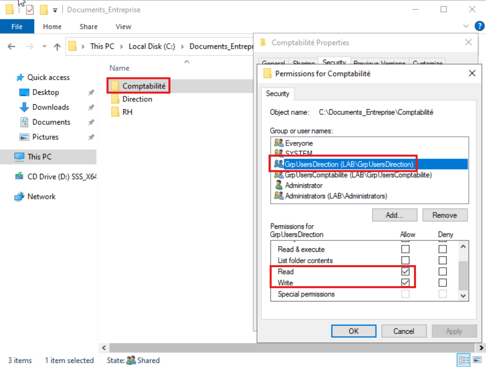 |  |
| --- | --- |

---
### Sous-dossier RH :
  - Droits de lecture :
    - Direction
    - RH
  - Droits d'écriture :
    - Direction
    - RH

Pensez bien à désactiver l'héritage dans les paramètres avancés de sécurité.

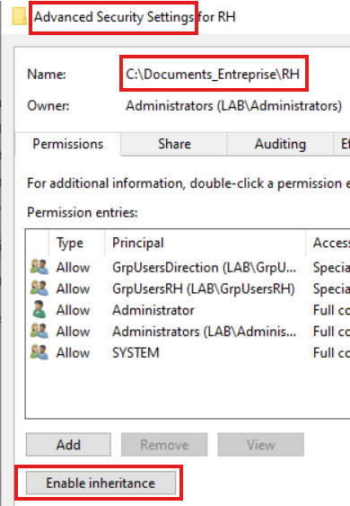

Le sous-dossier RH est accessible que par le Groupe RH et le Groupe Direction (GrpUsersRH - GrpUsersDirection).  
L'action s'effectue dans les propriétés du dossier dans l'onglet sécurité, vous devez ajouter le groupe correspondant aux dossier et mettre droit de lecture et d'écriture.

| 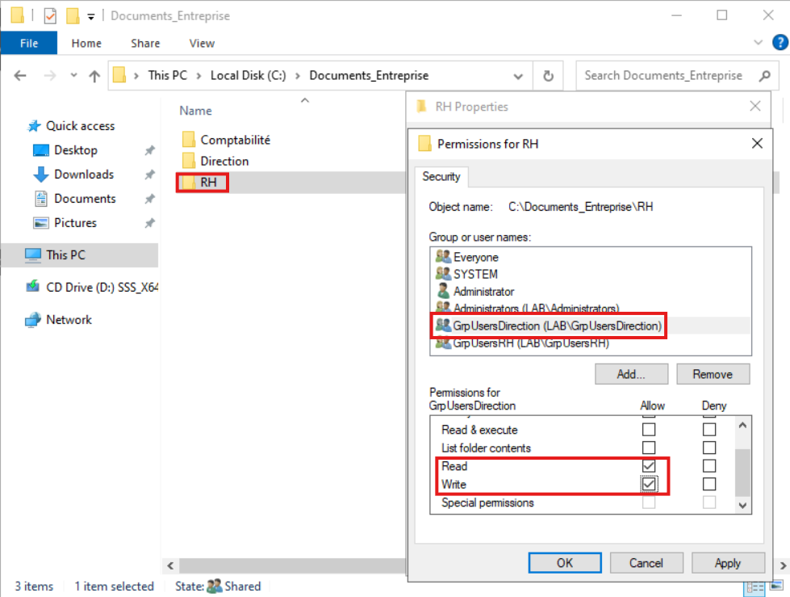 | 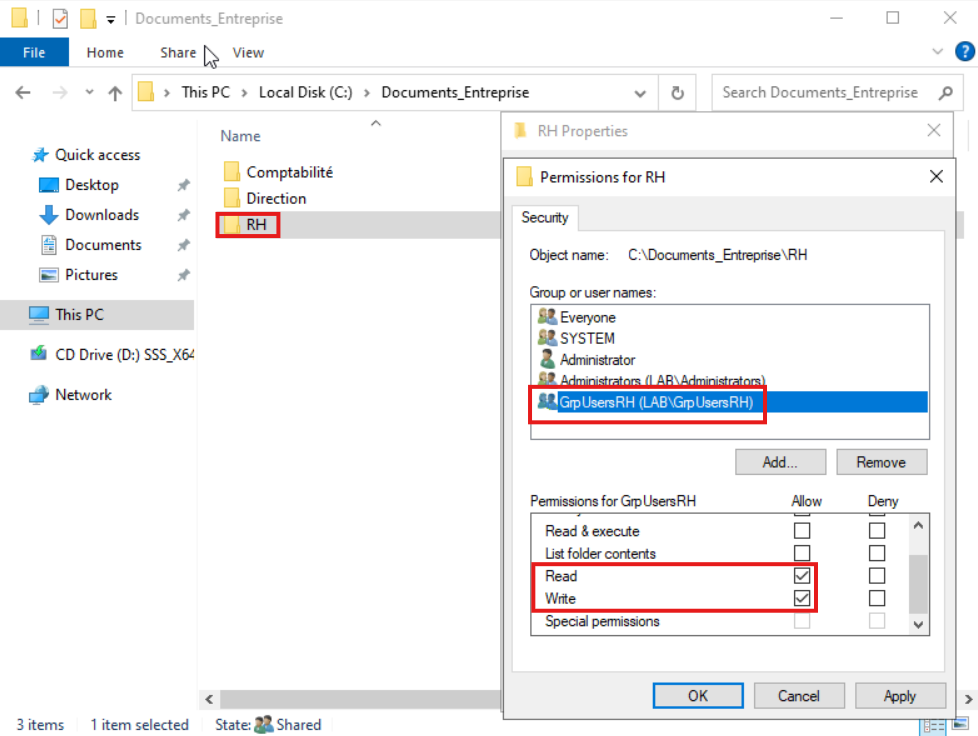 |
| --- | --- |

---

## 4. Test machine Client

Une fois le client lié au domaine du serveur AD vous pourrez tester les accès de chaque utilisteurs sur les dossiers.

### Utilisteur Direction

Initialisation du partage via CLI.  
Le dossier partagé se retrouve sur le disque "Z" du client.

Test du partage via CLI.  
Vous pouvez observez que l'utilisateur "Direction" à accès à tout les dossiers.

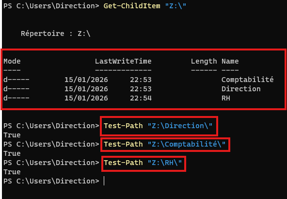

### Utilisteur Comptabilité

Initialisation du partage via CLI.  
Le dossier partagé se retrouve sur le disque "Z" du client.

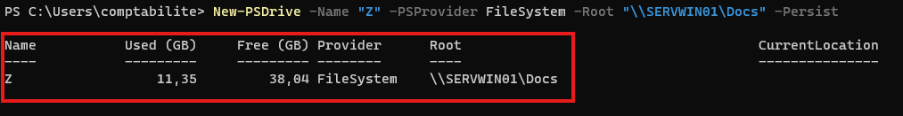

Test du partage via CLI.  
Vous pouvez observez que l'utilisateur "Comptabilité" n'à accès que à son dossier.

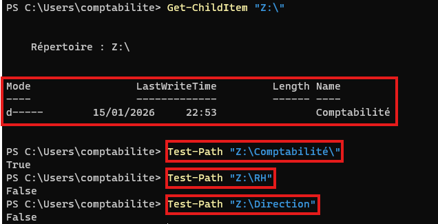

### Utilisteur RH

Initialisation du partage via CLI.  
Le dossier partagé se retrouve sur le disque "Z" du client.

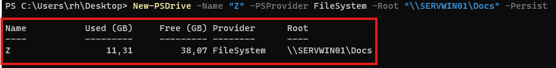

Test du partage via CLI.  
Vous pouvez observez que l'utilisateur "RH" n'à accès que à son dossier.

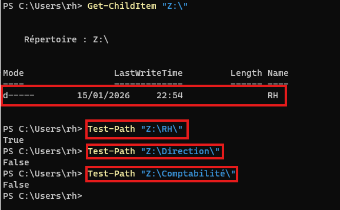

### Utilisteur Wilder

Initialisation du partage via CLI.  
Le dossier partagé se retrouve sur le disque "Z" du client.

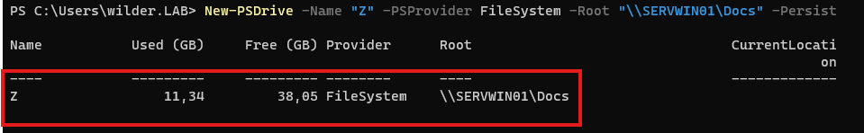

Test du partage via CLI.  
Vous pouvez observez que l'utilisateur "Wilder" n'à accès à aucun dossier.

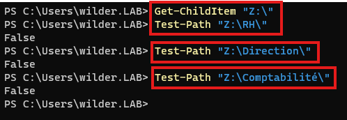

---
