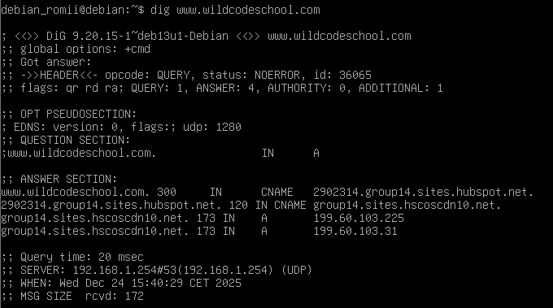
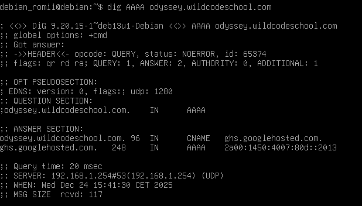

# Atelier_CMD_dig

## Analyse Adresses IPv4 de www.wildcodeschool.com

* **CMD** : `dig www.wildcodeschool.com` 

* `193.60.103.31 et 193.60.103.225` sont les adresses IP du site.

## Analyse Adresses IPv6 de odyssey.wildcodeschool.com

* **CMD** : `dig AAAA odyssey.wildcodeschool.com`

* `2a00:1450:4007:80d::2013` est l'adresse IP du site
* L'hébergeur quand à lui est `HubSpot`
