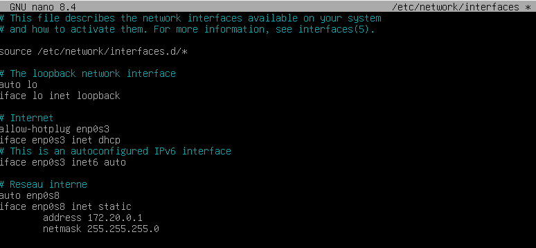
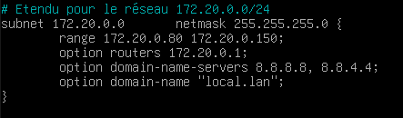
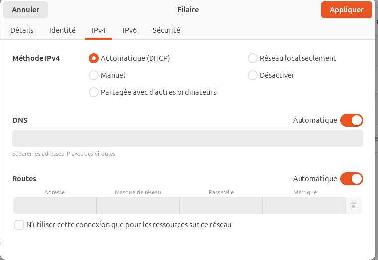
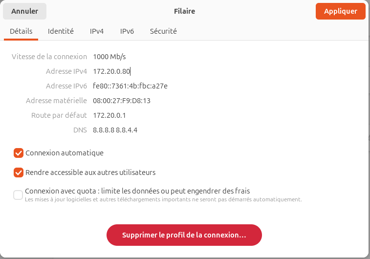
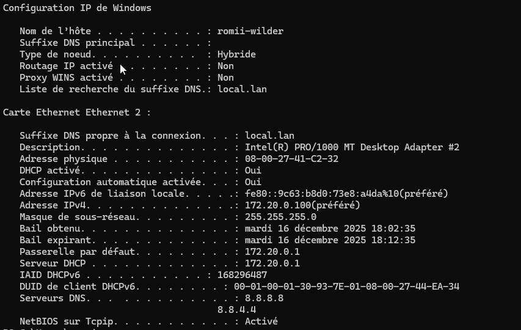

# Atelier_DHCP_avec_Debian

Configuration complète d'un serveur DHCP sur Debian avec étendue et réservation d'adresse.

## Configuration :

* Réseau : 172.20.0.0/24
* Serveur DHCP : 172.20.0.1
* Étendue DHCP : 172.20.0.80 - 172.20.0.150
* Réservation : 172.20.0.100 (Debian)

## Serveur DHCP (Windows Serveur) :

Configuration du serveur DHCP :

* Dans le fichier /etc/network/interfaces  

* Dans le fichier /etc/dhcp/dhcp.conf  

## Client (Ubuntu) :

Configuration IP du Client 1 :

* En interface graphique

|  |  |
| --------------------------- | ------------------------------- |

## Client 2 (Windows 11) :

Configuration IP du Client 2 :

* Dans le fichier /etc/dhcp/dhcp.conf du serveur Debian  

* Sur le client 2  

