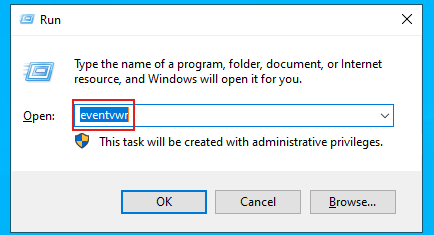
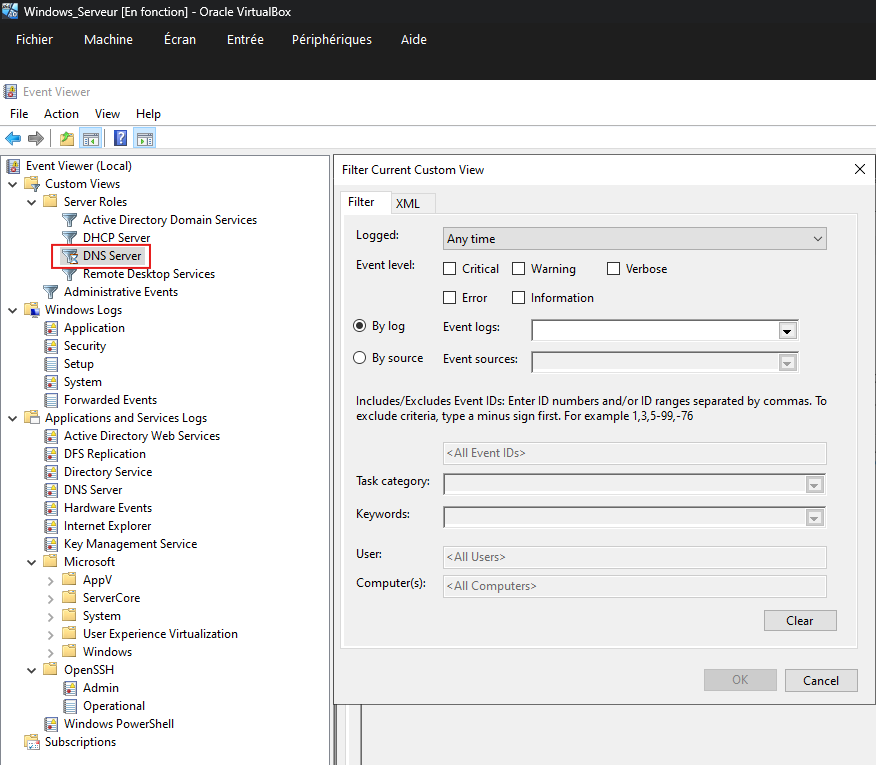
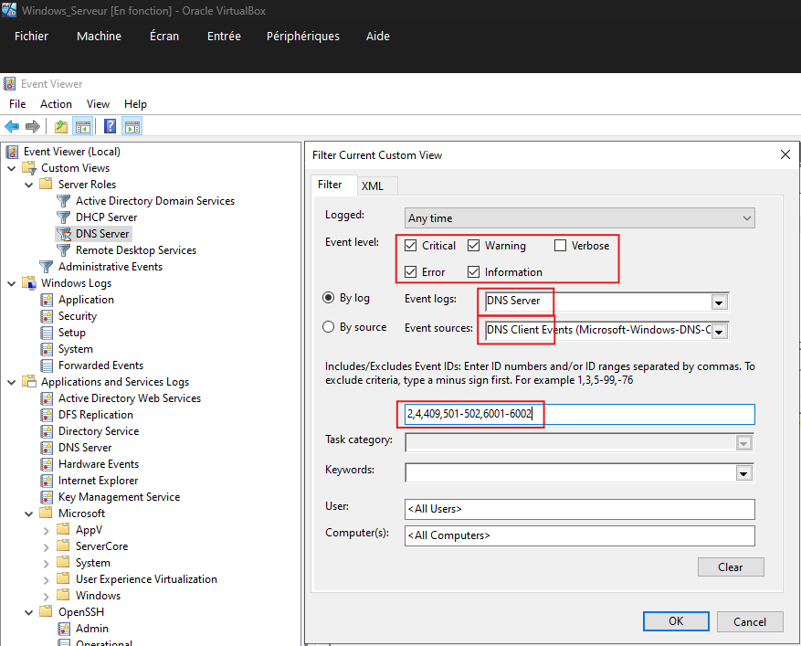
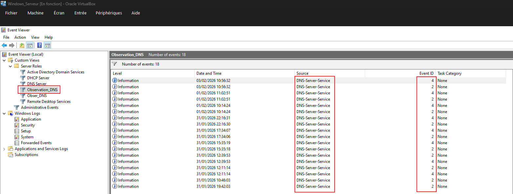

# Observateur_Evenements_Windows

## Acceder a l'observateur d'événements

- Exécuter l'observateur avec la commande `eventvwr`

## Acces aux filtres sur l'observateur d'événements

- Pour créer un filtre :
  - Il y a un bouton `create a custom view` dans la section Action à droite de l'écran
  - Ou l'option `create a custom view` en faisant clic droit sur le serveur DNS

## Options de filtrage

- Les options choisis pour ce cas :
  - Affichage :
    - Des événements Critiques
    - Des Erreurs
    - Des Informations
    - Des Avertissements
  - Elle concernes exclusivement le DNS et plus particulierement :
    - Les événements Clients
    - Les événements Serveurs
  - Filtre sur l'ID
    - 2: Démarrage du serveur DNS
    - 4: Arrêt du serveur DNS
    - 409: Erreur de résolution de nom
    - 501-502: Échec de chargement de zone
    - 6001-6002: Problèmes de réplication DNS

## Résutat de la recherche personalisé

- Le résltat montre bien que la source vient du serveur DNS sur les ID 2 er 4.

## Fichier Observation_DNS.xml

[Fichier Observation_DNS.xml](Ressources/Observateur_Evenement_Windows/Observation_DNS.xml)

- La congiguration de mon filtre se trouve dans le liens si dessus.
